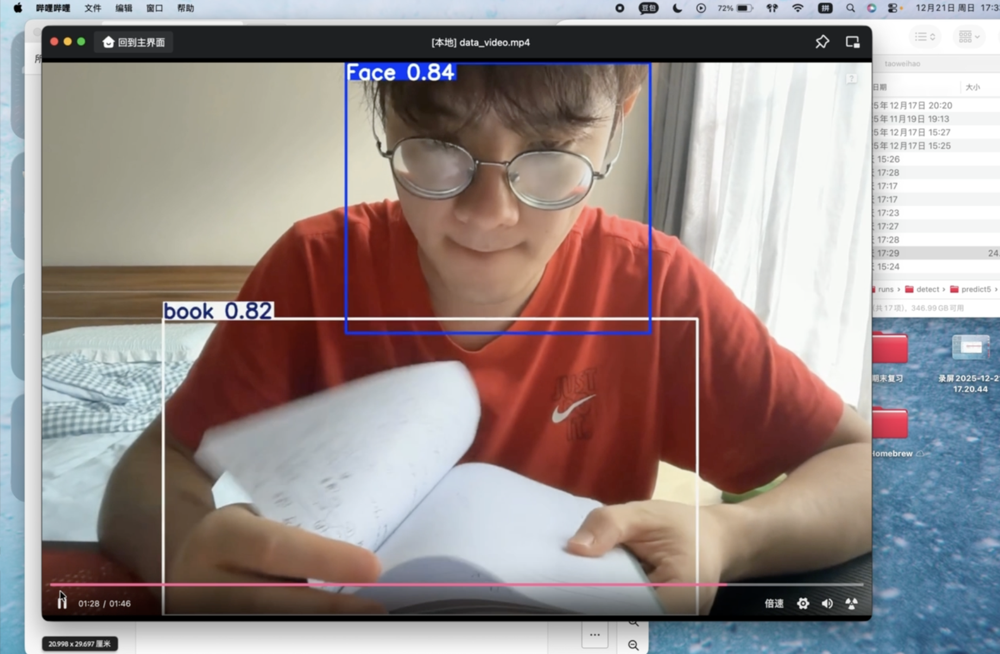

# 👁️ Smart Proctor - 基于 YOLOv8 的监考行为检测系统

<div align="center">
  <a href="https://www.bilibili.com/video/BV1vCrhBUEjQ/" target="_blank">
    
  </a>
  <br>
  <a href="https://www.bilibili.com/video/BV1vCrhBUEjQ/" target="_blank">
    <b>🎥 点击观看系统实时检测演示 (Bilibili)</b>
  </a>
  
  <br>
  <br>

  
  
  
  
  
  <p align="center">
    <b>针对线下机房考试场景的自动化监考解决方案</b>
    <br>
    <i>实时检测手机使用、查阅书籍等违规行为</i>
  </p>
</div>

---

## 📖 项目简介 (Project Description)

本项目实现了一套轻量级的**在线考试智能监考行为检测系统**。针对线下机房考试场景，利用 **YOLOv8n (Nano)** 模型的高效推理能力，系统能够在低算力设备上实时识别考试中的违规行为，辅助监考工作。

**核心功能：**
* **📱 手机检测 (Phone Detection)**：精准识别考生拿起手机、接听电话、操作屏幕等行为。
* **📚 书籍检测 (Book Reading)**：识别翻阅书籍、复习资料等作弊行为。
* **⚡ 轻量化部署**：核心权重文件 (`best.pt`) 经过优化，适合在普通 PC 或边缘设备上流畅运行。

## 📂 文件结构说明 (Folder Structure)

本项目提交包的文件组织结构如下：

```text
Smart-Proctor/
├── 📄 README.md                # 📘 当前项目说明文档
├── 📁 01_Documents/            # 📝 项目文档资料
│   ├── Final_YOLOv8.pdf        # 🎓 最终项目报告与创新点阐述
│   └── System_User_Manual.pdf  # 📖 系统操作与使用说明书
├── 📁 02_Source_Code/          # 💻 核心源代码
│   ├── extract_images.py       # 🛠️ 视频预处理：均匀抽帧脚本
│   └── train_colab.ipynb       # 🧠 模型训练代码 (Google Colab Notebook)
├── 📁 03_Model_Weights/        # ⚖️ 模型权重文件
│   └── best.pt                 # 🎯 训练好的 YOLOv8n 最佳权重 (核心文件)
└── 📁 04_Video_Data/           # 📼 数据集与演示资源
    ├── data_video.mp4          # 📦 用于制作数据集的 90秒原始素材
    └── show_video.mp4          # 🎬 本地演示视频文件